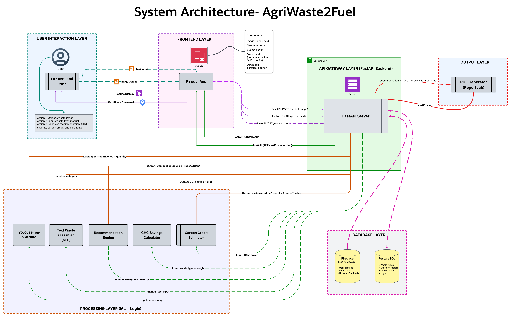

# AgriWaste2Fuel – Turning Agricultural Waste into Green Energy

**Annam.Ai Hackathon-Based Internship Project – Group 3A**  
> An initiative under the Annam.AI Hackathon 2025

---

## Project Overview

**AgriWaste2Fuel** is an AI-powered web application that helps farmers and rural communities convert their agricultural waste into useful resources like **compost** or **biogas**, while estimating **GHG savings**, calculating **carbon credits**, and generating a **certificate of impact**.

This project is built as part of the **Annam.AI Hackathon**, which aims to solve real-world problems in the agri-tech and sustainability domains using AI and open-source technology.

---

##  Problem Statement

> **Domain:** Agriculture & Environment  
> **Challenge:** Efficient farm waste management with environmental benefit tracking.

We aim to build a **smart waste converter** that:
- Detects & classifies farm waste.
- Recommends biogas or compost processing.
- Estimates GHG emissions saved.
- Converts those savings into potential carbon credits.

---

## Team Members – Group 3A


| Name             | Email                             | Phone       | Institution & Year                            | Role                              |
|------------------|------------------------------------|-------------|-----------------------------------------------|-----------------------------------|
| Yashodip More    | yashodipmore2004@gmail.com         | 7820811636  | R.C. Patel Institute of Technology, 4th Year  | Team Leader, Backend & Deployment |
| Komal Kumavat    | komalkumavat025@gmail.com          | 9860690939  | R.C. Patel Institute of Technology, 4th Year  | Frontend Developer                |
| S.M. Sakthivel   | m.sakthivelofficial@gmail.com      | 7418194398  | Achariya College of Engineering Technology, 4th Year | Database, Cloud & Integration     |
| Barun Saha       | barun.vsaha@gmail.com              | 8708322197  | VIT Chennai, Mechatronics – 4th Year          | ML Engineer (NLP, Carbon Credits) |
| Bibaswan Das     | bibaswand04@gmail.com              | 7044895853  | VIT Chennai, CSE – 4th Year                   | ML Engineer (YOLOv8, GHG Logic)   |


---

## Mentor

**Name:** Dr. Niranjan Deshpande 
**Contribution:** Provided weekly guidance, helped in refocusing on core objectives and practical implementation.

---

## System Architecture



We follow a modular, scalable architecture:

1. **User Layer**: Farmer uploads an image or manually enters waste type.
2. **Frontend**: React app with intuitive UI to upload, view results, and download certificate.
3. **API Gateway**: FastAPI backend manages all logic, data routing, and model calls.
4. **Processing Layer**:
   - YOLOv8 model classifies waste from image
   - NLP classifies manually entered waste
   - Recommendation engine suggests Compost or Biogas
   - GHG calculator estimates CO₂e saved
   - Credit estimator returns carbon credits + ₹ value
   - PDF generator creates certificate
5. **Database Layer**:
   - Firebase: User auth (optional), upload logs
   - PostgreSQL: Emission factors, waste types, credit rates
6. **Output**: JSON response + certificate download link
7. **Deployment**:
   - Frontend: Vercel
   - Backend: Render
   - Model: TorchServe / Flask API

---


---

## System Modules

### 1. **Farm Waste Detection & Classification**
- Image-based detection (YOLOv8)
- Manual keyword input (NLP/regex)
- Waste quantity estimation

### 2. **Biogas or Compost Recommendation**
- Decision tree logic based on type & quantity
- Output: suggested method, steps, tools, expected result

### 3. **GHG Savings Prediction**
- Use weight and standard emission factors
- Calculate savings using:  
  `GHG Saved = weight × (EF_burning − EF_conversion)`

### 4. **Carbon Credit Estimation**
- 1 ton CO₂e saved = 1 credit
- Multiply by market rate
- Optional: generate digital certificate

---

##  Features

- [x] AI waste classification via image (YOLOv8)
- [x] Manual text input classification (NLP)
- [x] Smart recommendation: Compost or Biogas
- [x] GHG Savings Calculator (IPCC factors)
- [x] Carbon Credit & Income Estimator
- [x] Downloadable Certificate of Impact (PDF)
- [x] Clean, mobile-first UI (React + Tailwind)

---

## Tech Stack (Proposed)

| Layer             | Tools / Frameworks                       |
|------------------|------------------------------------------|
| Frontend         | React.js, Tailwind CSS                   |
| Backend          | FastAPI, Python                          |
| ML/AI            | YOLOv8, HuggingFace Transformers, NLTK  |
| Database         | PostgreSQL, Firebase                     |
| PDF Generator    | ReportLab                               |
| Deployment       | Vercel (Frontend), Render (Backend)      |
| Infra Tools      | GitHub Actions, TorchServe (optional)    |

---

## 🧪 Setup Instructions

### 🔧 Backend
```bash
git clone https://github.com/<repo>/AgriWaste2Fuel
cd backend
pip install -r requirements.txt
uvicorn main:app --reload
```

### 💻 Frontend
```bash
cd frontend
npm install
npm run dev
```

---

## 🧪 Sample API Response
```json
{
  "waste_type": "cow dung",
  "method": "biogas",
  "ghg_savings_tons": 0.42,
  "carbon_credits": 0.42,
  "estimated_income_inr": 840,
  "certificate_url": "/api/download/certificate?id=abc123"
}
```

---

##  Folder Structure
```
AgriWaste2Fuel/
├── frontend/            # React App
├── backend/             # FastAPI Backend
│   ├── app/
│   ├── models/          # YOLOv8 / NLP logic
│   ├── routes/          # API endpoints
│   └── utils/           # Recommender, PDF, GHG logic
├── models/              # Pretrained weights
├── docs/                # Architecture, planning, reports
└── README.md
```

---

## Expected Output

- Waste category & quantity
- Recommended waste treatment method
- GHG saved in tons of CO₂e
- Carbon credits earned
- Farmer-friendly dashboard

---

## Next Steps

1. Complete team GitHub repository setup.
2. Implement Module 1 (YOLOv8 + manual input system).
3. Develop initial UI prototype (React or Flutter).
4. Integrate GHG calculator and credit estimation.
5. Finalize dataset sources and regression models.

## 🏁 Milestones

| Milestone                    | Status         |
|-----------------------------|----------------|
| Idea Finalized              | ✅ Done        |
| Architecture Designed       | ✅ Done        |
| Module Breakdown & Issues   | ✅ Done        |
| YOLOv8 + GHG + Credit Logic | 🔄 In Progress |
| Frontend & API Integration  | 🔄 In Progress |
| Testing & Demo Prep         | ⏳ Pending     |
| Final Submission            | ⏳ Pending     |

---

## Contribution Guidelines

- All team members will commit weekly updates.
- Use feature branches and pull requests for collaboration.
- Document all scripts and models.

---

##  Acknowledgements

Thanks to the **Annam.Ai team** and our **mentors** for providing this opportunity and guidance to innovate on real-world agricultural challenges.

---
